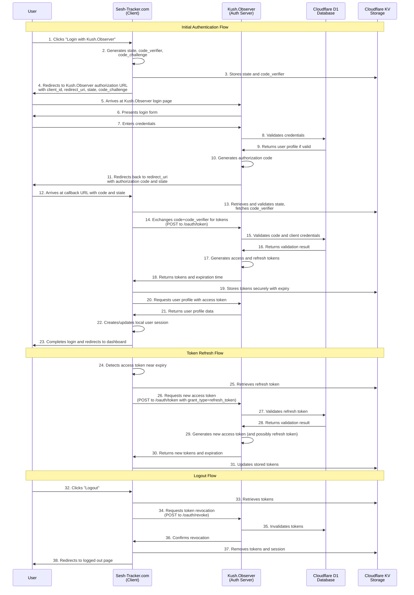
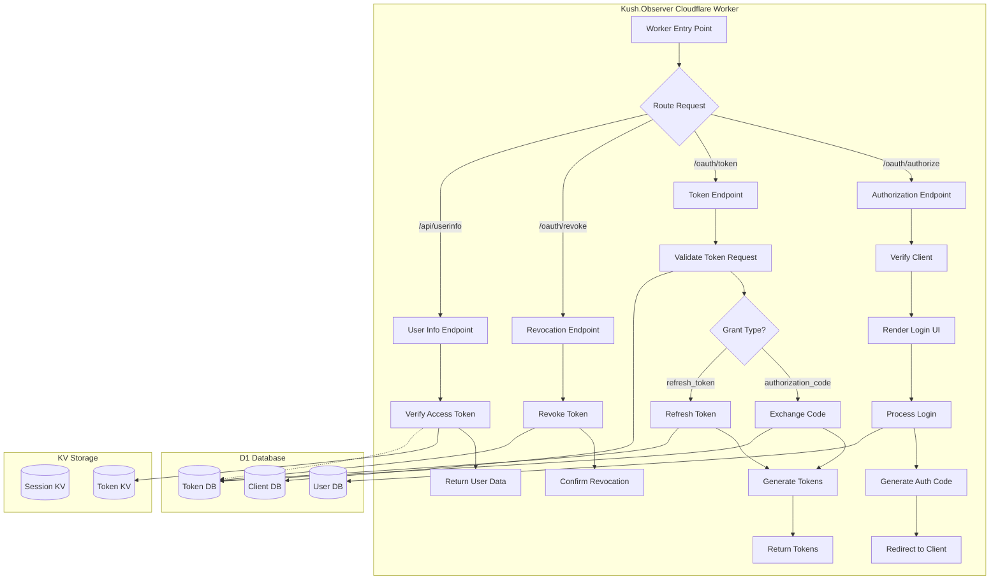

# OAuth Authentication Flow Sequence (Cloudflare Implementation)

This document provides a sequence diagram that illustrates the authentication flow between Sesh-Tracker.com and Kush.Observer, implemented on Cloudflare Workers.

## OAuth 2.0 Authentication Flow

## Cloudflare Workers Implementation Notes

### D1 Database Usage

- User accounts and credentials are stored in Cloudflare D1
- OAuth clients and their configurations are stored in D1
- Authorization codes and tokens are stored with appropriate TTL

### KV Storage Usage

- Session states are stored in Cloudflare KV with appropriate TTL
- PKCE code verifiers are temporarily stored in KV
- Access tokens can be stored in KV for quick validation with appropriate TTL

### Authentication Endpoints

| Endpoint | Purpose | Notes |
|----------|---------|-------|
| `/oauth/authorize` | Initiates OAuth flow | Validates client_id, redirect_uri, and generates authorization code |
| `/oauth/token` | Exchanges code for tokens | Supports authorization_code and refresh_token grant types |
| `/oauth/revoke` | Revokes tokens | Invalidates access and refresh tokens |
| `/api/userinfo` | Returns user profile | Requires valid access token with appropriate scope |

### Environment Variables Required

| Variable | Purpose |
|----------|---------|
| `OAUTH_CLIENTS` | JSON array of registered OAuth clients |
| `JWT_SECRET` | Secret key for signing JWT tokens |
| `COOKIE_SECRET` | Secret for signing cookies |

### Error Handling

- All errors are returned with appropriate HTTP status codes and JSON bodies
- Error responses include `error` and `error_description` fields per OAuth 2.0 spec
- Rate limiting is applied to prevent brute force attacks

## Implementation Flowchart

## Security Considerations

1. **PKCE Implementation**: Always use PKCE (Proof Key for Code Exchange) to prevent authorization code interception attacks.
2. **Token Storage**: Store tokens securely in KV with appropriate TTL.
3. **HTTPS Only**: All communications must use HTTPS.
4. **State Parameter**: Always validate the state parameter to prevent CSRF attacks.
5. **Short-lived Tokens**: Configure access tokens with short lifetimes (e.g., 1 hour).
6. **Scoped Access**: Implement and enforce token scopes.

## Monitoring and Analytics

- Use Cloudflare Analytics to monitor authentication attempts and failures
- Set up alerts for suspicious activity patterns
- Track token usage and refresh patterns

---

This sequence diagram provides a comprehensive overview of the OAuth 2.0 authentication flow between Sesh-Tracker.com and Kush.Observer, implemented using Cloudflare Workers, D1 database, and KV storage. 